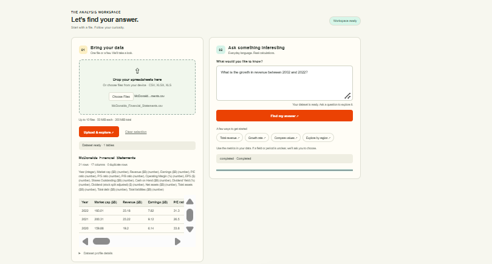
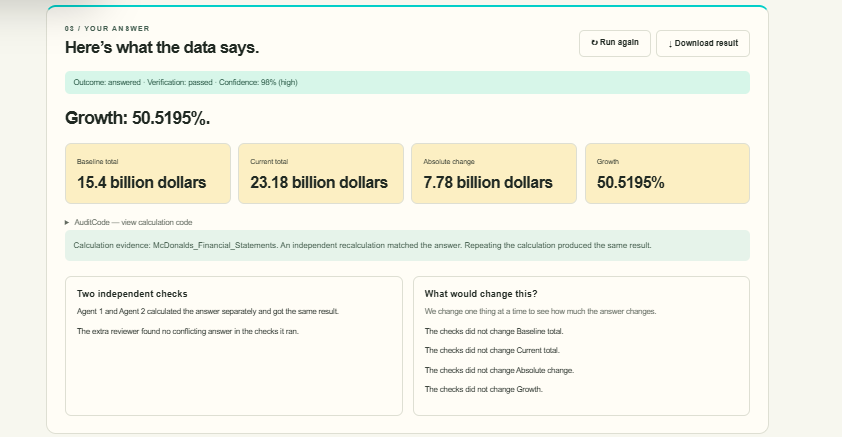

# SureCount — Working example

This walkthrough uses the supplied screenshots of a financial analyst asking about McDonald's revenue growth.

## 1. Open SureCount

The homepage introduces spreadsheet analysis with checked calculations and plain-language questions.

## 2. Upload a dataset and ask a question

Upload `McDonalds_Financial_Statements.csv`, preview its fields, and ask: **“What is the growth in revenue between 2002 and 2022?”**

## 3. Review the verified result

The displayed revenue increases from **15.4 billion dollars** to **23.18 billion dollars**, a change of **7.78 billion dollars**. Growth is `(23.18 − 15.4) ÷ 15.4 × 100 = 50.5195%` after rounding.

Agent 1 and Agent 2 agree, and the extra reviewer's tested changes leave the result unchanged. Expand **AuditCode** to inspect and copy the reproducible calculation. The screenshot's 98% confidence is an interpretation heuristic, not a guarantee of accuracy.

